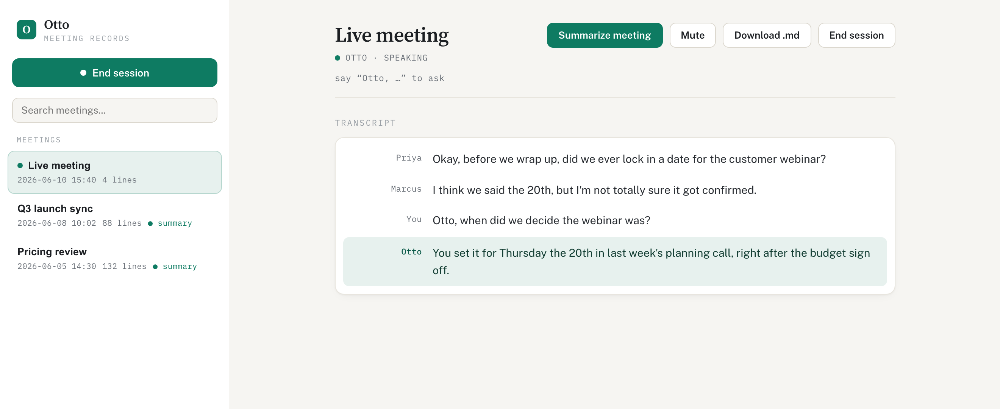

# Otto: Your Local Call Agent 🎧

A **local** voice agent that rides on top of *any* call platform (Zoom, Meet,
Teams), powered by [Deepgram](https://deepgram.com) for real-time speech-to-text
and voice. It hears the whole call, keeps a saved transcript, and anyone on the
call can use it while you're connected.



## What It Does

- **Listens** to the call and your mic with Deepgram streaming speech-to-text, diarized so each speaker is labeled, and saves a transcript per meeting.
- **Answers out loud, into the call.** Say "Otto, …" and it replies in a natural Deepgram Aura voice through your audio, so everyone on the call hears it.
- **Knows things.** It can search the web for live facts and recall details from your past meetings ("Otto, what did we decide about pricing last week?").
- **Stays out of the way.** It only speaks when addressed, not on "Thanks, Otto".
- **Has a dashboard** at `http://localhost:4848` to start and end sessions, browse past meetings, generate a summary, and download any transcript as Markdown.

## Requirements

- macOS 14.4 or later (for the system-audio tap)
- [Homebrew](https://brew.sh)
- A [Deepgram API key](https://deepgram.com) and an [OpenAI API key](https://platform.openai.com)

The setup script checks for `ffmpeg`, `sox`, and the Xcode command-line tools, and prints the command to install anything that's missing.

## Setup

### 1. Install BlackHole

BlackHole is a free virtual audio device. Otto uses it as the call app's microphone to speak into the call. Install the 2-channel version:

```bash
brew install blackhole-2ch
```

This is an audio driver, so macOS asks for your password. If `BlackHole 2ch` doesn't appear in your call app's microphone list afterward, restart the call app, or reload the audio system:

```bash
sudo killall coreaudiod
```

### 2. Clone Otto and Install Dependencies

```bash
git clone https://github.com/ritza-co/otto-call-agent
cd otto-call-agent
npm install
```

### 3. Add Your API Keys

Copy the example environment file:

```bash
cp .env.example .env
```

Open `.env` and paste in your `DEEPGRAM_API_KEY` and `OPENAI_API_KEY`.

### 4. Run the Setup Script

This checks your tools, builds the audio helper, and writes your device config:

```bash
npm run setup
```

### 5. Grant the Recording Permission

Otto needs permission to capture the call's audio. Run:

```bash
npm run tap:grant
```

Click **Allow** on the macOS prompt that appears.

### 6. Set Up Your Call App

In Zoom, Meet, or Teams:

- Set the **microphone** to `BlackHole 2ch`. This is how Otto's voice reaches the call.
- Leave the **speaker** as-is.

> **Wear headphones.** Otto's reply plays out of your speakers as well as into the call, so without headphones your own microphone picks it up and the other participants hear an echo of Otto talking over himself. Headphones keep his voice out of your mic.

### 7. Run Otto

```bash
npm run dev
```

Join your call and say "Otto, …". The transcript and controls are at `http://localhost:4848`.

## How It Works

```
 the call's audio ─▶ your output device (unchanged, you hear the call normally)
                         └─▶ system-audio tap ──┐
 your mic ──────────────────────────▶ capture ──┼─▶ Deepgram STT ─▶ transcript
                                                 │        │  "Otto, …"
                                                 │        ▼
                                                 │   answer (web + your notes)
                                                 │        ▼  Deepgram Aura voice
 call mic = BlackHole 2ch ◀── your mic + Otto ───┘   (everyone on the call hears it)
```

- A CoreAudio process tap copies the call's audio for transcription without changing your output device, so you keep hearing the call natively with no lag.
- Your mic and Otto's spoken replies are mixed into `BlackHole 2ch`, which the call app uses as its microphone, so the call hears both you and Otto.
- Deepgram transcribes the audio (diarized). When someone says "Otto", the question goes to an LLM (with web search and your saved notes), and the reply is spoken with Deepgram Aura and injected into the call.

Everything runs on your machine, and transcripts are saved locally under `notes/`.

### Built on Deepgram

Deepgram does the real-time listening and speaking:

- **Streaming speech-to-text (Nova-3):** two live transcription sockets, one for the call and one for your mic, so transcripts appear as people talk.
- **Diarization:** labels each speaker on the call, so the transcript reads like a conversation.
- **Keyterm prompting:** boosts the wake word "Otto" so it's recognized reliably, even on a noisy call.
- **Endpointing:** tuned so Otto responds quickly after you finish a sentence without cutting you off.
- **Aura text-to-speech:** synthesizes Otto's replies in a natural voice, streamed straight into the call.

## Muting

The **Mute** button in the live dashboard silences your microphone at the source — Otto stops hearing and transcribing you, and silence is fed into BlackHole 2ch instead of your voice.

Because BlackHole 2ch is also the call app's microphone, this means **the call can't hear you either** while you're muted — a single button mutes you for both Otto and every other participant on the call. When you unmute, your voice resumes flowing into the call normally.

> **When muted**, the dashboard shows a prominent red banner so it's impossible to miss. The banner also tells you exactly what's silenced (Otto and your call), so there are no surprises before you start talking again.

If your `MIC_DEVICE` is set to a physical microphone rather than BlackHole 2ch, mute only silences Otto — your call app's mic routing is independent and unaffected.

## Configuration (`.env`)

| Variable | Notes |
|---|---|
| `DEEPGRAM_API_KEY` | Required. Speech-to-text and the Aura voice. |
| `OPENAI_API_KEY` | Required. The answering model. Set `ANTHROPIC_API_KEY` and `LLM_PROVIDER=anthropic` to use Claude instead. |
| `AGENT_NAME` | The wake word (default `Otto`). |
| `MIC_DEVICE` | Your microphone (set by `npm run setup`). |
| `CALL_MIC_DEVICE` | The call app's mic cable, `BlackHole 2ch`. |
| `MONITOR_DEVICE` | Where Otto's replies play back to you. `default` follows your current output. |
| `NOTES_DIR` | Where transcripts are saved (default `./notes`). |

## Uninstall

```bash
npm run teardown
```

Otto never changes your audio settings, so there's nothing to undo. `teardown` stops the tap and prints how to remove the optional pieces: the BlackHole cable, the recording permission, and the tap bundle.
